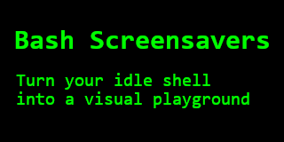
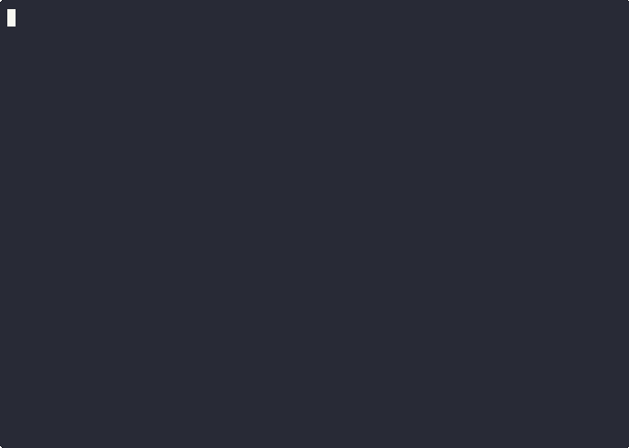

# Bash Screensavers



Tired of your boring old terminal?
Wish you could spice up your command line with some animated ASCII art?
Well, you've come to the right place!

Welcome to **Bash Screensavers**, a collection of screensavers written entirely in `bash`.

Because who needs fancy graphics cards and complex rendering engines
when you have `echo`, `sleep`, and a little bit of `tput` magic?

[Gallery](#gallery) -
[Quickstart](#quickstart) -
[Contributing](#contributing) - 
[Spotlight](#spotlight) -
[Jury](#jury) -
[Library](#library) -
[Chat](#chat)

[](https://github.com/attogram/bash-screensavers/releases)
[](./LICENSE)

[](https://github.com/attogram/bash-screensavers/commits/main/)
[](https://github.com/attogram/bash-screensavers/stargazers)
[](https://github.com/attogram/bash-screensavers/watchers)
[](https://github.com/attogram/bash-screensavers/forks)
[](https://github.com/attogram/bash-screensavers/issues)

## Gallery

The [Gallery README](./gallery/README.md) has info on all the screensavers.

[](./gallery/README.md)

## Quickstart

```bash
git clone https://github.com/attogram/bash-screensavers.git
cd bash-screensavers
./screensaver.sh
```
```
Bash Screensavers v0.0.27 (Mystic Shine)

  1 . alpha        - random colorful pixels
  2 . bouncing     - bouncing 'O' madness
  3 . cutesaver    - infinite loop of cuteness
  4 . fireworks    - Ooh! Aah! Pretty lights!
  5 . life         - cellular automata
  6 . matrix       - the matrix has you
  7 . pipes        - an endless pipe maze
  8 . rain         - soothing, gentle rain
  9 . speaky       - dramatic talking screensaver
  10. stars        - twinkling starfield
  11. tunnel       - fly into the digital tunnel
  12. vibe         - vibe coding

(Press ^C to exit)

Choose your screensaver:
```

## Command-Line Usage

### Start with the menu of screensavers
`./screensaver.sh`

### Start with a specific screensaver

`./screensaver.sh name`

`./screensaver.sh number`

### Start with a random screensaver:

`./screensaver.sh -r`

### Get help

`./screensaver.sh -h`

### Get version

`./screensaver.sh -v`

### Direct run of a screensaver

`./gallery/name/name.sh`

## Contributing

We welcome contributions!

For the nitty-gritty, see [CONTRIBUTING.md](./CONTRIBUTING.md).

Vibe coders and [AI Assistants](./AGENTS.md) are welcome to join the party.

## Spotlight

The spotlight is a set of curator tools for marketing and publicity fluff,
like pretty previews of all the screensavers.

Read the [Spotlight Manual](./spotlight/README.md) for details.

## Jury

The jury makes sure the gallery is up-to-snuff. 

They test **everything**. They're a bit batsy about it.

See the [Jury Criteria](./jury/README.md) for the rules.

## Not Ready For Primetime

This directory contains screensavers that are not yet ready for general use.

They may be broken, incomplete, or just not up to the quality standards of the main gallery.

Feel free to experiment with them, but use them at your own risk!

## Library

The library is filled with stuff about visualizations and voices.

Read the [Library Index](./library/README.md) to get started.

## Chat

Have questions, ideas, or just want to chat? 

[**Join our Discord server!**](https://discord.gg/BGQJCbYVBa)


---

*Made with ❤️ and a lot of bash.*
 
 
 
 
 
 
 
 
 
 
 
